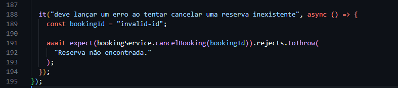

# Desafio Técnico: Desenvolvimento Orientado a Testes (TDD)

## Como rodar os testes do projeto

- Se quiser rodar somente os arquivos de testes que o desafio pede para criar, utilize o seguinte comando:

```
    npm run test:challenge
```

OBS: O único teste que não foi implementado foi o teste do arquivo booking_service descrito no tópico 5. Pois o mesmo já estava implementado:


- Se quiser rodar todos os testes, utilize esse comando:

```
    npm run test
```

## Detalhes do desafio

Os detalhes do desafio estão [nesse arquivo](./challenge.md)
